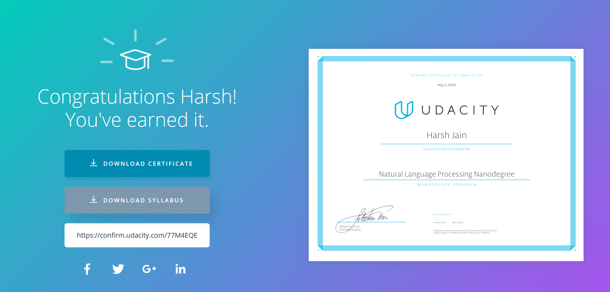

## Udacity-NLP-Nanodegree
This repository contains the project work done as part of the NLP Nanodegree program offered by Udacity.

This Nanodegree program helps to learn cutting-edge natural language processing techniques to process speech and analyze text. The program helps to Build probabilistic and deep learning models, such as hidden Markov models and recurrent neural networks, to teach the computer to do tasks such as speech recognition, machine translation, and more!

## Certificate of Completion

## Projects of Natural Language Processing
Read the readme files in each project directory to understand the installation and working of the project. Following is the list of the projects made as part of the Nanodegree program:

1. [Spam Classifier using Naive Bayes Theorem](https://github.com/hjain5164/Udacity-NLP-Nanodegree/tree/master/Spam%20Classifier%20-%20Project%20Work-1)

2. [Part-Of-Speech Tagger with Hidden Markove Model](https://github.com/hjain5164/Udacity-NLP-Nanodegree/tree/master/Part%20of%20Speech%20Tagger%20using%20HMM%20-%20Project%20Work-2)

3. [Topic Modeling using Latent Dirichlet Allocation technique](https://github.com/hjain5164/Udacity-NLP-Nanodegree/tree/master/Topic%20Modeling%20-%20Project%20Work-3)

4. [Sentiment Analysis using Gradient-Boosted Decision Tree classifier and RNNs](https://github.com/hjain5164/Udacity-NLP-Nanodegree/tree/master/Sentiment%20Analysis%20-%20Project%20Work-4)

5. [Understanding Attentions](https://github.com/hjain5164/Udacity-NLP-Nanodegree/tree/master/Understanding%20Attention%20-%20Project%20Work-5)

6. [Deciphering Code with Character-Level RNNs](https://github.com/hjain5164/Udacity-NLP-Nanodegree/tree/master/Deciphering%20Code%20with%20Character-Level%20RNN%20-%20Project%20Work-6)

7. [Machine Translation (English to French) using 5 different RNN Architectures](https://github.com/hjain5164/Udacity-NLP-Nanodegree/tree/master/Machine%20Translation%20(English%20to%20French)%20-%20Project%20Work-7)

8. [Capstone Project - Speech Recognizer using 6 different RNN Architectures](https://github.com/hjain5164/Udacity-NLP-Nanodegree/tree/master/Speech%20Recognizer%20-%20Project%20Work-8)
